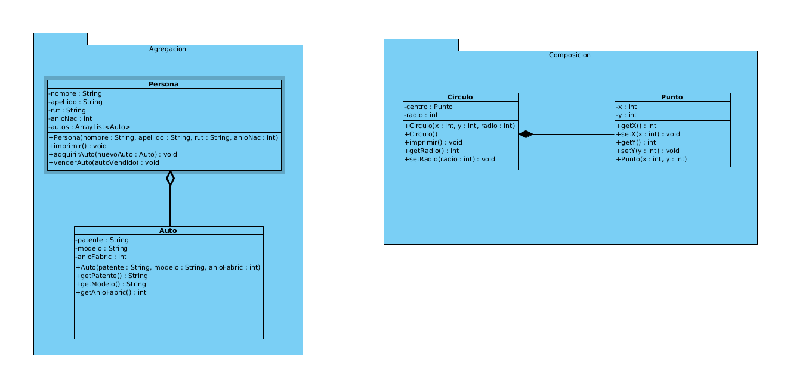

# Ejemplo POO agregación y composición
## 25/03
### Instrucciones:
1.- Un círculo se describe por medio de un punto central y su radio. Al mismo tiempo, un punto se define por medio de una coordenada x y una coordenada y. Se requiere que ambas clases posean sus métodos get y set. La clase Círculo debe tener un método imprimir que muestre en pantalla el siguiente mensaje “El centro del círculo es la coordenada (x, y), y tiene un radio de z.  

2.- Una persona se describe por medio de su nombre, su apellido, su año de nacimiento y su rut. Una persona puede hacer uso de su auto para transportarse, y respecto de ese auto (que se representa con una patente, un modelo, y un año de fabricación), una persona puede comprar un auto, y además posteriormente venderlo. Además una persona puede o no tener 1 o varios autos. La clase personal debe tener un método imprimir que muestre en pantalla toda su información, incluida la información de sus autos, y los métodos para adquirir y vender autos.

### Diagrama de clases:
